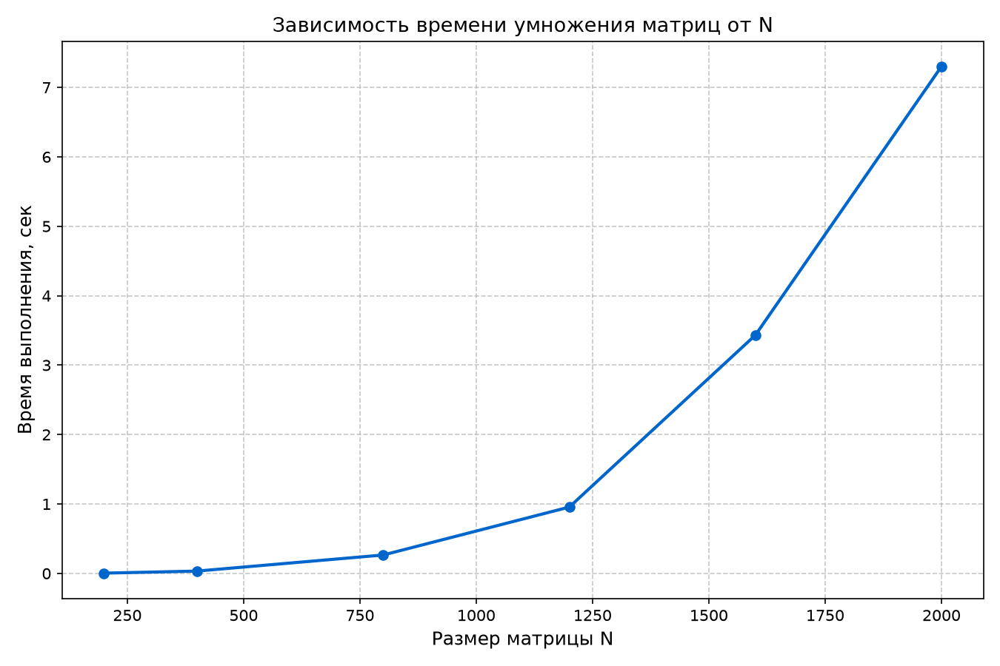

# Лабораторная работа №1
## Умножение квадратных матриц (последовательная версия)

**Выполнил студент:** Екимов Никита Алексеевич
**Группа:** 6214-100503D  
**Курс:** Параллельное программирование

---

## 1. Задание

Написать программу на языке C/C++ для перемножения двух квадратных матриц.

**Входные данные:** файлы со значениями исходных матриц.

**Выходные данные:** файл с результирующей матрицей, время выполнения, объём задачи.

**Дополнительные сведения:** обязательна автоматизированная верификация результатов с помощью сторонних библиотек (NumPy / Matlab).

---

## 2. Реализация

- Язык программирования: C++ (по стандарту C++17).
- Умножение реализовано тройным циклом в порядке `i-k-j`.
- Замер времени: `std::chrono::high_resolution_clock`.
- Верификация: Python + NumPy (`numpy.dot`).

### Алгоритм умножения

```cpp
for (int i = 0; i < N; ++i) {
    for (int k = 0; k < N; ++k) {
        double a_ik = A[i][k];
        for (int j = 0; j < N; ++j) {
            C[i][j] += a_ik * B[k][j];
        }
    }
}
```

Порядок циклов `i-k-j` выбран для лучшей локальности кэша: при данном порядке числа читаются из памяти друг за другом, а не вразброс, и это позволяет процессору проще и быстрее их подгружать, умножение работает быстрее.

Теоретическая сложность алгоритма — **O(N³)**.

---

## 3. Структура проекта

```
lab1/
├── src/
│   └── lab1.cpp                  — исходный код программы
├── input/
│   ├── matrix_a.txt              — матрица A
│   └── matrix_b.txt              — матрица B
├── output/
│   ├── result.txt                — результат умножения
│   ├── info.txt                  — размер, объём задачи, время
│   ├── experiments.txt           — таблица экспериментов
│   └── graph.png                 — график зависимости времени от N
└── README.md
```

---

## 4. Верификация

Результат работы программы сравнивается с эталонным результатом, вычисленным через `numpy.dot`.

**Команда:**
```
py -3.12 ..\scripts\verify.py input\matrix_a.txt input\matrix_b.txt output\result.txt 0.01
```

**Результат (N = 200):**
```
[OK] ВЕРИФИКАЦИЯ ПРОЙДЕНА (макс. расхождение: 5.91e-12)
```

Максимальное расхождение составило 5.91·10⁻¹², что соответствует машинной точности типа `double`. Входные матрицы записываются с 15 значащими цифрами, что обеспечивает минимальные потери точности при чтении и записи.

---

## 5. Результаты экспериментов

Замеры выполнены для размеров 200, 400, 800, 1200, 1600, 2000.  
Матрицы заполнены случайными числами из диапазона [-10, 10].

| N    | N²         | Время ЦПУ, с | Общее время, с |
|-----:|-----------:|-------------:|---------------:|
| 200  | 40 000     | 0.004086     | 0.166239       |
| 400  | 160 000    | 0.033902     | 0.487409       |
| 800  | 640 000    | 0.265373     | 1.719187       |
| 1200 | 1 440 000  | 0.955391     | 4.122635       |
| 1600 | 2 560 000  | 3.431920     | 9.063517       |
| 2000 | 4 000 000  | 7.301890     | 16.063680      |

«Время ЦПУ» — чистое время умножения, измеренное внутри программы.  
«Общее время» — полное время запуска процесса, включая чтение и запись файлов.

---

## 6. График



На графике видно, что время выполнения растёт нелинейно, оно соответствует кубической зависимости. Экспериментальные точки лежат близко к теоретической кривой O(N³).

---

## 7. Выводы

1. Время работы программы растёт пропорционально N³, что подтверждает теоретическую оценку сложности. При увеличении N в 2 раза время увеличивается примерно в 8 раз.

2. Верификация через NumPy подтвердила корректность вычислений: расхождение не превышает 6·10⁻¹², то есть находится в пределах машинной точности типа `double`.

3. Порядок циклов `i-k-j` обеспечивает лучшую производительность, чем  привычный `i-j-k` за счёт более эффективной работы с кэшем.

4. Данная последовательная реализация будет использована как основа для следующих л.р.

---

## 8. Запуск

### Сборка

```
cl /O2 /EHsc /std:c++17 /Fe:lab1.exe lab1.cpp
copy lab1.exe ..\
```

### Генерация матриц

```
py -3.12 ..\scripts\generate_matrix.py 200 input\matrix_a.txt input\matrix_b.txt
```

### Запуск умножения

```
lab1.exe input\matrix_a.txt input\matrix_b.txt output\result.txt output\info.txt
```

### Верификация

```
py -3.12 ..\scripts\verify.py input\matrix_a.txt input\matrix_b.txt output\result.txt 0.01
```

### Полная серия экспериментов

```
cd ..\scripts
py -3.12 experiments.py
py -3.12 plot_graphs.py
```